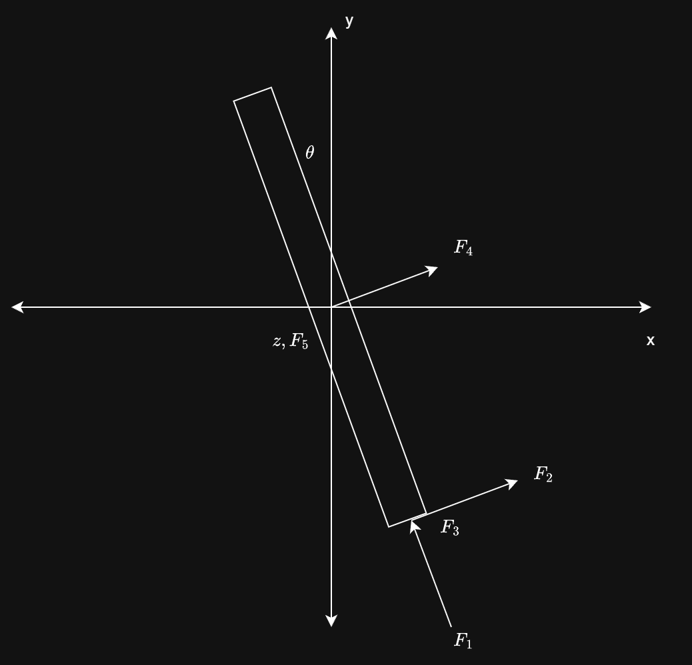

# Rocket Re-entry Stabilization using LQR
## Modeling

### Assumptions
- Lumped heterogenous-mass model
- Thrust vector is resolved into $F_1$, $F_2$, $F_3$ in the rocket's body reference frame
- Lateral thrust acting at center of gravity (COG) is denoted as $F_4$ and $F_5$
- Forces $F_1$, $F_4$ and $F_5$ act on the COG and result in the translation of COG, and $F_2$ and $F_3$ act as torques about COG
- Air drag can be linearized using Taylor's expansion

$F_1$, $F_4$ and $F_5$ can be resolved into inertial reference frame using rotation matrices, as follows:

$$
\begin{bmatrix}
F_x \\
F_y \\
F_z
\end{bmatrix} = \begin{bmatrix}
cos(\theta) & -sin(\theta) & 0 \\
sin(\theta) & cos(\theta) & 0 \\
0 & 0 & 1 \\
\end{bmatrix} \begin{bmatrix}
1 & 0 & 0 \\
0 & cos(\phi) & -sin(\phi) \\
0 & sin(\phi) & cos(\phi) \\
\end{bmatrix}\begin{bmatrix}
F_4 \\
F_1 \\
F_5
\end{bmatrix}
$$

### Equations of Motion
$m \ddot{x} = F_x$
$m \ddot{y} + mg - \left( \frac{1}{2} \cdot \rho \cdot A \cdot C_d \cdot \dot{y}^2 \right) = F_y$
$m \ddot{z} = F_z$
$^oI_{zz} \ddot{\theta} = F_2 \cdot \frac{l}{2}$
$^oI_{xx} \ddot{\phi} = F_3 \cdot \frac{l}{2}$

State Vector: $x, y, z, \theta, \phi, \dot{x}, \dot{y}, \dot{z}, \dot{\theta}, \dot{\phi}$
Inputs: $F_1, F_2, F_3, F_4, F_5$

### State Space Representation
$$
A = \begin{bmatrix}
0 & 0 & 0 & 0 & 0 & 1 & 0 & 0 & 0 & 0 \\
0 & 0 & 0 & 0 & 0 & 0 & 1 & 0 & 0 & 0 \\
0 & 0 & 0 & 0 & 0 & 0 & 0 & 1 & 0 & 0 \\
0 & 0 & 0 & 0 & 0 & 0 & 0 & 0 & 1 & 0 \\
0 & 0 & 0 & 0 & 0 & 0 & 0 & 0 & 0 & 1 \\
0 & 0 & 0 & 0 & 0 & 0 & 0 & 0 & 0 & 0 \\
0 & 0 & 0 & 0 & 0 & 0 & \left( \frac{1}{m} \cdot \rho \cdot A \cdot C_d \right) & 0 & 0 & 0 \\
0 & 0 & 0 & 0 & 0 & 0 & 0 & 0 & 0 & 0 \\
0 & 0 & 0 & 0 & 0 & 0 & 0 & 0 & 0 & 0 \\
0 & 0 & 0 & 0 & 0 & 0 & 0 & 0 & 0 & 0 \\
\end{bmatrix} 
$$

$$
B = \begin{bmatrix}
0 & 0 & 0 & 0 & 0 \\
0 & 0 & 0 & 0 & 0 \\
0 & 0 & 0 & 0 & 0 \\
0 & 0 & 0 & 0 & 0 \\
0 & 0 & 0 & 0 & 0 \\
0 & 0 & 0 & 1/m & 0 \\
1/m & 0 & 0 & 0 & 0 \\
0 & 0 & 0 & 0 & 1/m \\
0 & 6/\left(m \cdot l \right) & 0 & 0 & 0 \\
0 & 0 & 6/\left(m \cdot l \right) & 0 & 0 \\
\end{bmatrix}
$$
